```mermaid
graph TD
    %% Main Navigation Container
    MainLayout[MainLayout]
    AuthWrapper[AuthWrapper]
    
    %% Core Providers
    UserProvider[CRUDUser Provider]
    ProjectProvider[CRUDProject Provider]
    RepoProvider[CRUDRepo Provider]
    CommentProvider[CRUDComment Provider]

    %% Shared Components
    RefreshIndicator[RefreshIndicator]
    ErrorHandler[Error Handling]
    LoadingIndicator[Loading Indicator]
    EmptyState[Empty State Handler]
    ScrollPhysics[AlwaysScrollableScrollPhysics]
    
    %% Main Pages
    HomePage[HomePage]
    AppStorePage[AppStorePage]
    RepositoryList[RepositoryList]
    MyProjects[MyProjects]
    ProfilePage[ProfilePage]
    
    %% MyProjects Tabs
    MyRepository[MyRepository]
    MyApps[MyApps]
    
    %% Unique Components
    PagingController[PagingController]
    TabController[TabController]
    SearchBar[SearchBar]
    FilterSort[Filter & Sort]
    ProfileInfo[Profile Information]
    
    %% Connections
    AuthWrapper --> MainLayout
    MainLayout --> |Navigation| HomePage
    MainLayout --> |Navigation| AppStorePage
    MainLayout --> |Navigation| RepositoryList
    MainLayout --> |Navigation| MyProjects
    MainLayout --> |Navigation| ProfilePage
    
    %% Provider Connections
    UserProvider --> HomePage
    UserProvider --> ProfilePage
    UserProvider --> MyRepository
    ProjectProvider --> AppStorePage
    ProjectProvider --> MyApps
    ProjectProvider --> HomePage
    RepoProvider --> RepositoryList
    RepoProvider --> MyRepository
    CommentProvider --> ProfilePage
    
    %% Shared Component Connections
    RefreshIndicator --> HomePage
    RefreshIndicator --> AppStorePage
    RefreshIndicator --> RepositoryList
    RefreshIndicator --> MyRepository
    RefreshIndicator --> MyApps
    RefreshIndicator --> ProfilePage
    
    ErrorHandler --> HomePage
    ErrorHandler --> AppStorePage
    ErrorHandler --> RepositoryList
    ErrorHandler --> MyRepository
    ErrorHandler --> MyApps
    ErrorHandler --> ProfilePage
    
    LoadingIndicator --> HomePage
    LoadingIndicator --> AppStorePage
    LoadingIndicator --> RepositoryList
    LoadingIndicator --> MyRepository
    LoadingIndicator --> MyApps
    LoadingIndicator --> ProfilePage
    
    EmptyState --> HomePage
    EmptyState --> AppStorePage
    EmptyState --> RepositoryList
    EmptyState --> MyRepository
    EmptyState --> MyApps
    
    ScrollPhysics --> HomePage
    ScrollPhysics --> AppStorePage
    ScrollPhysics --> RepositoryList
    ScrollPhysics --> MyRepository
    ScrollPhysics --> MyApps
    ScrollPhysics --> ProfilePage
    
    %% Unique Component Connections
    PagingController --> RepositoryList
    TabController --> MyProjects
    MyProjects --> MyRepository
    MyProjects --> MyApps
    SearchBar --> AppStorePage
    SearchBar --> RepositoryList
    FilterSort --> AppStorePage
    FilterSort --> RepositoryList
    ProfileInfo --> ProfilePage

    %% Styles
    classDef provider fill:#e1f5fe,stroke:#01579b
    classDef shared fill:#f1f8e9,stroke:#33691e
    classDef page fill:#fce4ec,stroke:#880e4f
    classDef unique fill:#fff3e0,stroke:#e65100
    classDef container fill:#ede7f6,stroke:#4527a0
    
    class UserProvider,ProjectProvider,RepoProvider,CommentProvider provider
    class RefreshIndicator,ErrorHandler,LoadingIndicator,EmptyState,ScrollPhysics shared
    class HomePage,AppStorePage,RepositoryList,MyProjects,ProfilePage,MyRepository,MyApps page
    class PagingController,TabController,SearchBar,FilterSort,ProfileInfo unique
    class MainLayout,AuthWrapper container
```

# Component Diagram Overview

This diagram shows the relationships between different components in our Flutter application.

## Main Components

### Navigation Containers
- **AuthWrapper**: Handles authentication state and routes to appropriate screens
- **MainLayout**: Contains bottom navigation and manages main page transitions

### Core Providers
- **CRUDUser**: Manages user data and authentication
- **CRUDProject**: Handles project data operations
- **CRUDRepo**: Manages repository data
- **CRUDComment**: Handles comment operations

### Shared Components
- **RefreshIndicator**: Pull-to-refresh functionality
- **Error Handling**: Consistent error display and retry mechanisms
- **Loading Indicator**: Loading state management
- **Empty State Handler**: Empty data state displays
- **ScrollPhysics**: Consistent scrolling behavior

### Main Pages
- **HomePage**: Dashboard with recent items
- **AppStorePage**: Browse and search apps
- **RepositoryList**: Browse and search repositories
- **MyProjects**: Tab view of user's apps and repositories
- **ProfilePage**: User profile and settings

### Unique Components
- **PagingController**: Pagination for RepositoryList
- **TabController**: Tab management for MyProjects
- **SearchBar**: Search functionality
- **Filter & Sort**: Data filtering and sorting
- **Profile Information**: User profile display

## Color Legend
- 🔵 Blue: Providers (State Management)
- 🟢 Green: Shared Components
- 🔴 Red: Main Pages
- 🟡 Orange: Unique Components
- 🟣 Purple: Navigation Containers
